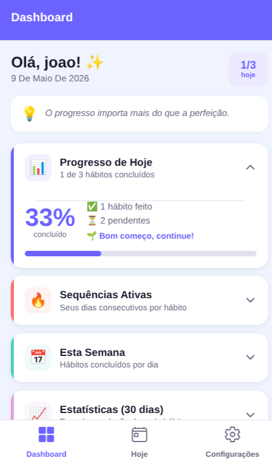
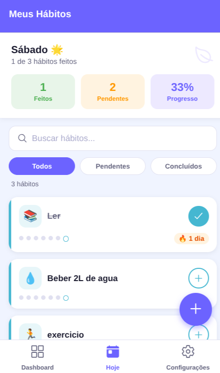
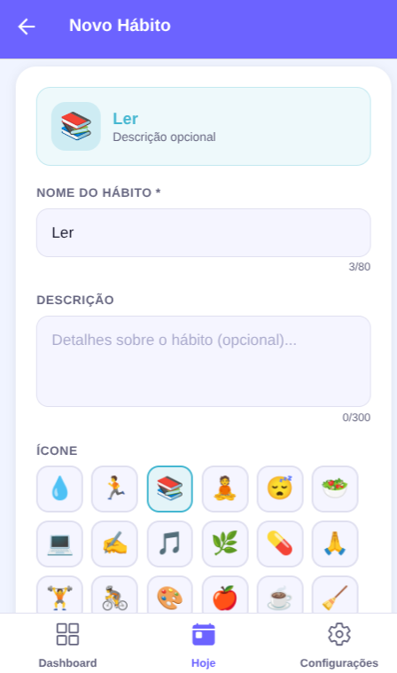
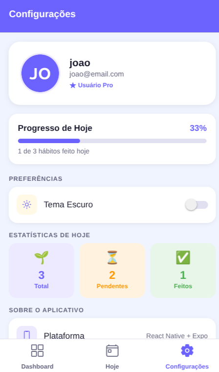

# 👥 Equipe — MS Productivity

Disciplina: Desenvolvimento de Aplicativos Mobile
Professor: Igor Revoredo
Ano: 2026

---

## Integrantes

| Nome | Matrícula |
|---|---|
| Eduardo Martins Da Silva | 01799746 |
| Thiago Victor Dias Macêdo | 01798289 |

---

## Componentes Desenvolvidos por Cada Membro

### Eduardo Martins Da Silva — 01799746

**Telas:**
- `LoginScreen.js` — Tela de login com campos de email/senha, toggle de mostrar senha, ActivityIndicator e componente `Image` (logo do app)
- `RegisterScreen.js` — Tela de cadastro com validação de nome, email e senha
- `DashboardScreen.js` — Tela principal com 4 cards expansíveis (acordeão), barra de progresso e animação via `LayoutAnimation`
- `HomeScreen.js` — Lista de hábitos com `FlatList`, campo de busca, filtros (Todos/Pendentes/Concluídos) e marcação de hábito do dia

**Infraestrutura e navegação:**
- `App.js` — Ponto de entrada da aplicação
- `AppNavigator.js` — Configuração do Stack Navigator (Login/Cadastro) e Bottom Tab Navigator (Dashboard/Hoje/Configurações)
- `AppContext.js` — Estado global via Context API: gerenciamento de usuário, hábitos, tema e todas as funções expostas para as telas (`useApp` hook)
- `themes.js` — Paletas de cores para tema claro e escuro
- `dateUtils.js` — Utilitários de data usados em todas as telas

---

### Thiago Victor Dias Macêdo — 01798289

**Telas:**
- `AddTaskScreen.js` — Formulário de criação de hábito com `TextInput`, grade de 24 emojis, paleta de 12 cores, preview em tempo real e botão nativo `Button`
- `TaskDetailScreen.js` — Detalhes do hábito com calendário de 21 dias, modo de edição e exclusão com confirmação
- `SettingsScreen.js` — Configurações com avatar via `Image`, toggle de tema (`Switch`), estatísticas do dia e logout

**Banco de dados e segurança:**
- `supabase.js` — Configuração da conexão com o banco de dados na nuvem (Supabase)
- `habitService.js` — Lógica de negócio: cálculo de streak, maior streak, taxa de conclusão e histórico
- `security.js` — Validação e sanitização de todos os inputs (proteção contra XSS, injeção de código, limites de caracteres)
- `storage.js` — Wrapper do AsyncStorage para persistência local
- Configuração do banco: tabela `habits` no Supabase com Row Level Security (RLS)

**Componentes:**
- `HabitCard.js` — Card de hábito com histórico semanal visual e streak
- `DashboardCard.js` — Card expansível (acordeão) usado no Dashboard
- `EmptyList.js` — Componente de lista vazia
- `AppModal.js` — Modal de confirmação/alerta personalizado (substitui o Alert nativo para funcionar no web)

---

## 📱 Prints das Telas

  
  &nbsp;&nbsp;
  
  &nbsp;&nbsp;
  

  <em>Login &nbsp;&nbsp;&nbsp;&nbsp;&nbsp;&nbsp;&nbsp;&nbsp;&nbsp;&nbsp;&nbsp;&nbsp;&nbsp;&nbsp;&nbsp;&nbsp;&nbsp;&nbsp;&nbsp;&nbsp;&nbsp;&nbsp;&nbsp;&nbsp;&nbsp;&nbsp;&nbsp; Dashboard &nbsp;&nbsp;&nbsp;&nbsp;&nbsp;&nbsp;&nbsp;&nbsp;&nbsp;&nbsp;&nbsp;&nbsp;&nbsp;&nbsp;&nbsp;&nbsp;&nbsp;&nbsp;&nbsp;&nbsp;&nbsp;&nbsp;&nbsp;&nbsp;&nbsp;&nbsp; Meus Hábitos</em>

  
  &nbsp;&nbsp;
  

  <em>Novo Hábito &nbsp;&nbsp;&nbsp;&nbsp;&nbsp;&nbsp;&nbsp;&nbsp;&nbsp;&nbsp;&nbsp;&nbsp;&nbsp;&nbsp;&nbsp;&nbsp;&nbsp;&nbsp;&nbsp;&nbsp;&nbsp;&nbsp;&nbsp;&nbsp;&nbsp;&nbsp;&nbsp;&nbsp;&nbsp; Configurações</em>

